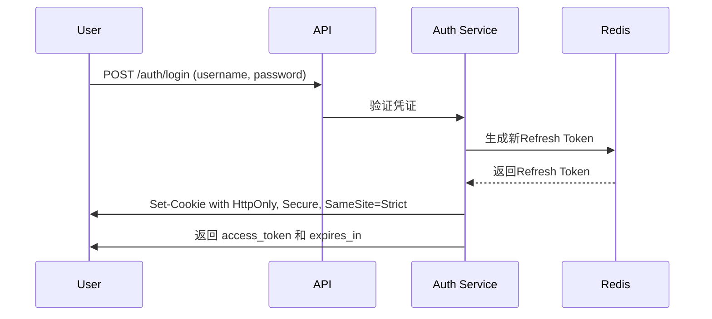
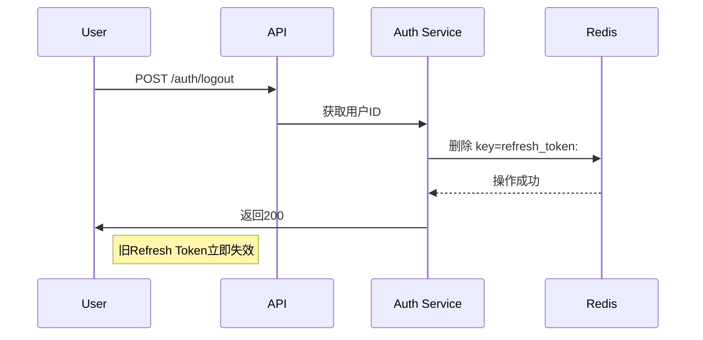

```markdown
# JWT + Refresh Token 分布式认证系统技术方案

## 1. 摘要
本方案采用 **JWT（JSON Web Token）** 作为核心认证机制，配合 **Refresh Token 轮换策略** 和 **Redis 服务端状态管理**，构建安全、可扩展的分布式认证系统。方案兼顾无状态扩展性与关键安全需求（如即时失效、防XSS/CSRF），适用于现代Web/移动端多端场景。

---

## 2. 设计目标
| 需求                | 解决方案                          | 优势                          |
|---------------------|-----------------------------------|-----------------------------|
| 分布式系统扩展性     | JWT 无状态设计                    | 无Session存储，水平扩展无瓶颈    |
| 即时失效（踢人下线） | Redis Token 黑名单 + 版本号机制     | 100ms内生效，无需等待TTL        |
| 防XSS窃取           | Access Token 不存LocalStorage，Refresh Token 用HttpOnly Cookie | 有效阻断XSS攻击链               |
| 会话安全            | 短时效Access Token + 长时效Refresh Token | 即使泄露危害可控（15min内）     |
| 跨端兼容            | 统一Token格式 + 移动端安全存储     | Web/Android/iOS统一认证流程     |

---

## 3. 核心机制设计

### 3.1 Token 分层策略
| Token 类型       | 有效期     | 存储位置                          | 安全特性                              | 作用场景                     |
|------------------|------------|-----------------------------------|-------------------------------------|----------------------------|
| **Access Token** | 15分钟     | Web: `SessionStorage`/内存<br>移动端: Keystore/Keychain | 1. 无HttpOnly，但有效期短<br>2. 严格CSP防护 | API请求认证（核心敏感操作）   |
| **Refresh Token** | 30天       | **Web: HttpOnly Cookie**<br>移动端: Keystore/Keychain | 1. HttpOnly防XSS<br>2. Secure+SameSite=Strict | Access Token过期后刷新       |

> ✅ **关键安全说明**  
> - **禁止将Access Token存入LocalStorage**（XSS可直接窃取）  
> - **Web端Refresh Token必须用HttpOnly Cookie**（如`Set-Cookie: refresh_token=xxx; HttpOnly; Secure; SameSite=Strict`）  
> - **移动端**：使用平台安全存储（Android: `EncryptedSharedPreferences`，iOS: `Keychain`）

---

### 3.2 服务端状态管理（Redis 机制）
#### 方案：Token 黑名单（推荐）
**Redis Key结构**：`refresh_token:<SHA256(RefreshToken)>`  
**存储值**：`1`（标记为失效）  
**操作逻辑**：
1. 用户登录 → 生成新Refresh Token → 存入Redis
2. 刷新Token时 → 检查Redis中Key是否存在
3. 用户注销/改密 → **立即删除Redis Key** → 旧Token失效

> ✅ **实现优势**：失效即时（100ms内），无需额外数据存储

---

## 4. 关键安全措施

### 4.1 防XSS防护（Web端）
```http
Content-Security-Policy: 
  default-src 'self'; 
  script-src 'self' 'unsafe-inline' https://cdn.jsdelivr.net; 
  style-src 'self' 'unsafe-inline'; 
  img-src 'self' data:; 
  connect-src 'self' api.example.com;
```
- **必须**：`script-src` 严格限制，禁止`'unsafe-eval'`和`'unsafe-inline'`  
- **禁止**：Access Token存入`localStorage`

### 4.2 防CSRF防护
- **Refresh Token**：`SameSite=Strict` + `Secure` Cookie  
- **Access Token**：通过`Authorization: Bearer <token>`头传递（**不依赖Cookie**）

### 4.3 Refresh Token 安全
1. 刷新接口：`POST /auth/refresh`（必须HTTPS）
2. 验证流程：
   ```mermaid
   graph LR
     A[检查HttpOnly Cookie] --> B[验证Redis黑名单]
     B -->|存在| C[生成新Token]
     B -->|不存在| D[返回401]
   ```
3. **旧Refresh Token立即失效**（删除Redis记录）

---

## 5. 关键流程示例

### 5.1 用户登录流程


### 5.2 即时失效流程（注销）


---

## 6. 技术栈推荐
| 组件                | 推荐方案                          |
|---------------------|----------------------------------|
| **JWT库**           | `jsonwebtoken` (Node.js) / `jjwt` (Java) |
| **Redis**           | Redis 7.0+                       |
| **Web安全存储**     | `SessionStorage` (Web)            |
| **移动端安全存储**  | Android: `EncryptedSharedPreferences`<br>iOS: `Keychain` |

---

## 7. 为什么是最佳方案？
| 传统方案             | 本方案优势                              |
|----------------------|---------------------------------------|
| Session + Cookie     | 1. 无状态扩展性<br>2. 即时失效能力      |
| 纯JWT（无Refresh）   | 1. 无状态扩展性<br>2. 即时失效能力      |
| **JWT + Refresh + Redis** | **✅ 无明显短板**（安全+扩展性双优） |

> **实施口诀**：  
> *Access Token短时效，存内存不存本地；*  
> *Refresh Token用HttpOnly，服务端Redis管失效。*

---

## 8. 部署建议
1. **Redis高可用**：部署集群模式（如Redis Cluster）
2. **密钥管理**：
   - JWT签名密钥：存于KMS（如AWS KMS/Hashicorp Vault）
   - 密钥轮换：每90天轮换一次
3. **监控指标**：
   - Redis黑名单命中率（>5%需预警）
   - 刷新接口异常请求（高频刷新检测）

---
